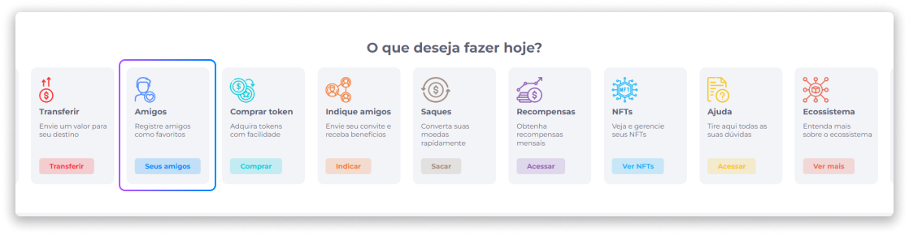
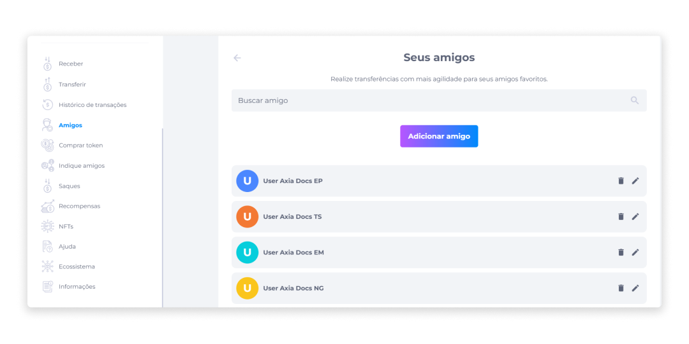
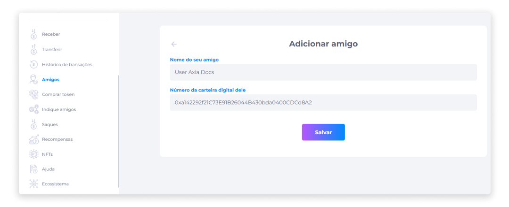

# Amigos
Para facilitar o acesso aos contatos favoritos ou frequentes no processo de transferência de ativos, a opção Amigos permite que o usuário adicione estes contatos à lista **Seus amigos**.

A lista de amigos irá fornecer o nome e o ID da carteira do contato adicionado.

Caso o contato já esteja salvo na lista de amigos do usuário, basta selecioná-lo na página de [transferência](../wallet/transfer.md) para agilizar o processo de transferência, ou pesquisá-lo na área de busca.

## Adicionar um amigo
Para adicionar amigos:

1. Clique em **Adicionar amigo**.

2. Insira um nome ou apelido.
3. Insira o número da carteira digital.
4. Clique em **Salvar**.

Após a ação de adicionar, o usuário poderá editar ou deletar o contato.

## Editar um amigo

Para editar os dados de um amigo adicionado:

1. Clique no ícone **Editar**.
2. Aplique as alterações nos campos específicos.
3. Clique em **Salvar** para confirmar as alterações.

## Deletar um amigo

Para remover um amigo da lista:

1. Identifique ou busque pelo contato que deseja remover.
2. Clique no ícone **Deletar.**
3. Confirme se realmente deseja excluir o amigo.