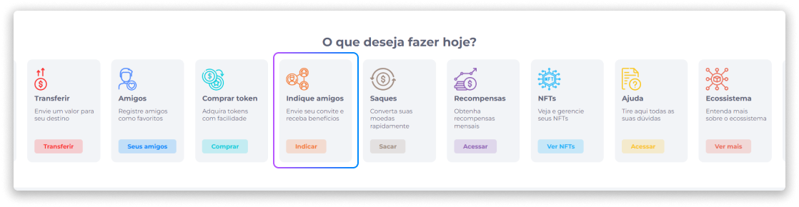
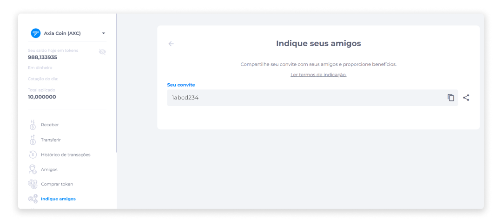

# Indique Amigos
A função de indicações disponibiliza para o usuário um código de convite que pode ser compartilhado para ser utilizado por outras pessoas no processo de criação de conta.

Na área **Indique seus amigos**, o usuário pode obter o código de convite e compartilhar.

Após receber o convite, a pessoa convidada deverá acessar o Midas e inserir o código no campo de convite da etapa **Dados de usuário** no momento de [criação da conta](../account/create.md).

Como estratégia para a adesão na plataforma, a empresa pode oferecer benefícios exclusivos para os usuários que forneceram o convite ou que foram convidados.