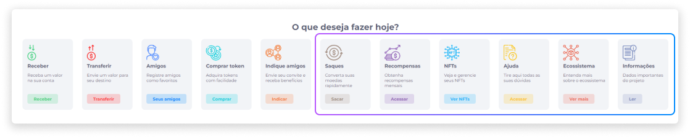

# Funcionalidades
Além das funcionalidades disponíveis através do menu Perfil, a carteira digital Midas dispõe de funções como [Saques](../wallet/withdrawals.md), [Recompensas](../wallet/rewards.md), [NFTs](../wallet/nfts.md), Ajuda, Ecossistema e Informações.

## Ajuda
A função de ajuda é uma opção configurável para o cliente. Ela permite que o usuário obtenha acesso a um link externo com informações que possam tirar possíveis dúvidas do usuário relacionadas a questões gerais da empresa. 

## Ecossistema
O ecossistema é uma rede de recursos que podem fazer parte da empresa, como produtos ou serviços, e que pode ser disponibilizada ao usuário através da seção de funcionalidades da carteira digital.

Na configuração do Ecossistema, a empresa pode inserir um documento HTML com informações adicionais sobre seus recursos. Esta configuração é feita pelo administrador da plataforma por meio de ações de Gerenciamento de Tokens no Axia BackOffice.

## Informações
Como último item da seção de funcionalidades, a área de Informações contém dados importantes sobre o projeto da empresa. Para fornecer estes dados, também é possível inserir um documento HTML ou link externo com as informações adicionais necessárias.