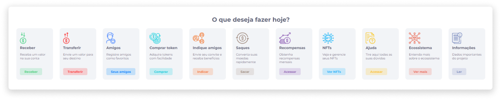
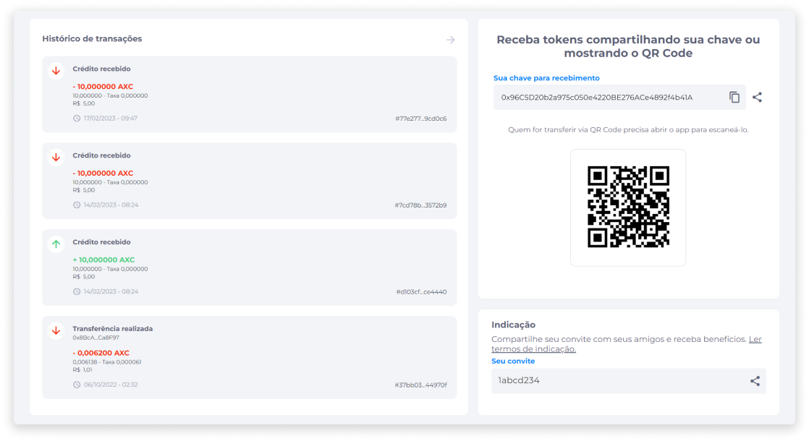

# Início
O início da Carteira Digital dispõe de recursos que visam facilitar a navegação na plataforma e auxiliar o usuário nas decisões de compra, transferências e outras operações.

A página inicial é dividida em seções de Saldos, Banners, Funcionalidades, acesso ao Histórico de Transações, chave e QR Code do usuário e código de indicação.

## Saldos

A seção de saldos exibe as moedas que o usuário tem disponível, seus saldos em token e em conversão para moeda fiduciária, a cotação atual da moeda selecionada e o total de tokens aplicados atualmente.

## Banners

O carrossel de banners personalizados é a área onde a empresa poderá inserir informações, notícias e divulgações ao usuário.

::: info ℹ️ <infoblocktitle>Configuração de Banners</infoblocktitle>
<infoblocktext>Para configurar os banners, é necessário adicionar uma imagem, um link para onde o usuário será redirecionado e um título. Esta configuração é feita pelo time da Axia, por isso, para solicitá-la, o cliente deve entrar em contato com o Suporte.</infoblocktext>
:::

## Funcionalidades

A seção de funcionalidades fornece o acesso rápido às ações que encontram-se disponíveis no menu Perfil, como [Receber](../wallet/receive.md), [Transferir](../wallet/transfer.md), [Amigos](../wallet/friends.md), [Comprar token](../wallet/buytokens.md) e [Indique amigos](../wallet/friendsindication.md).

Além disso, inclui acesso às funcionalidades [Saques](../wallet/withdrawals.md), [Recompensas](../wallet/rewards.md), [NFTs](../wallet/nfts.md), Ajuda, Ecossistema e Informações.

## Acesso Rápido

A página inicial exibe também o Histórico de Transações com o registro das transações mais recentes realizadas pelo usuário, o acesso rápido à chave e QR Code para recebimento de tokens e o código de convite para indicação de amigos.