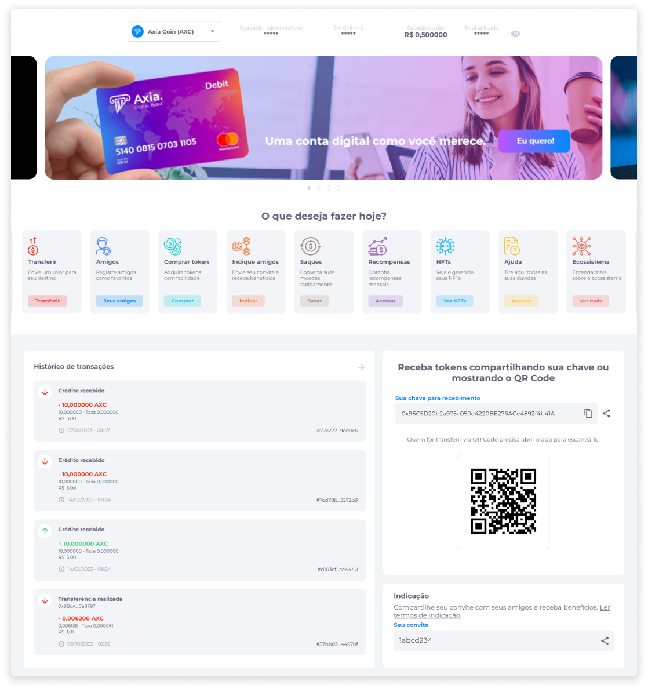
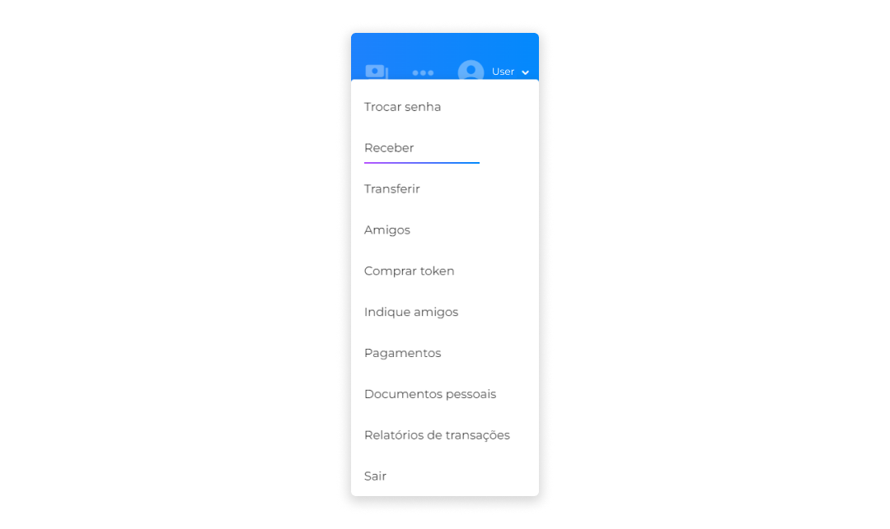
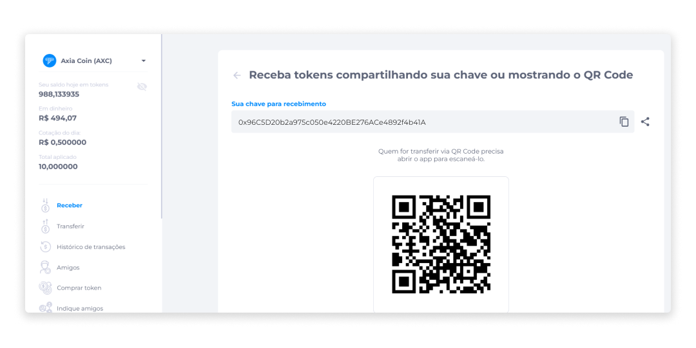

# Receber
No Midas, o usuário pode receber ativos em sua carteira digital. Este recebimento pode acontecer de duas formas:

- Chave da Carteira, que pode ser copiada e enviada, ou compartilhada pelo usuário com a pessoa responsável pela efetuação o pagamento.
- QR Code, que deve ser escaneado por quem irá efetuar o pagamento ao usuário do Midas.

::: info ℹ️ <infoblocktitle>Info</infoblocktitle>
<infoblocktext>Usuários do Midas poderão receber ativos de usuários de carteiras digitais externas, e o QR Code poderá ser lido por qualquer pessoa que tenha acesso ao código.</infoblocktext>
:::

A chave da carteira e o QR Code são disponibilizados na página inicial do Midas.

E também podem ser acessados através do menu Perfil, por meio da opção **Receber**.

A partir do acesso pelo menu Perfil, o usuário irá visualizar a tela com os dados para recebimento de ativos.

Sempre que houver o recebimento de algum ativo, o status do [histórico](../wallet/transactionshistory.md) será atualizado automaticamente.