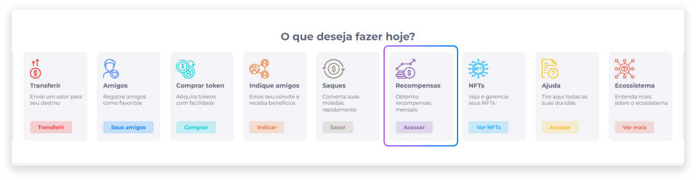
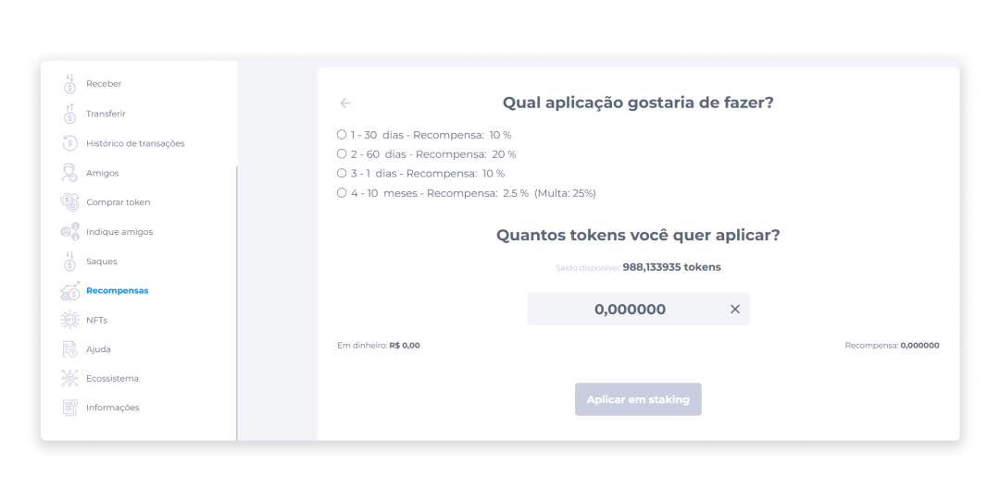

# Recompensas
Relacionadas ao mecanismo de Staking, as recompensas são pagamentos que um usuário pode receber a partir da aplicação de tokens.

## Aplicação de Tokens
Para realizar uma aplicação de tokens:

1. Na função **Recompensas** na página inicial, clique em **Acessar**.

2. Selecione o tipo de aplicação que deseja fazer.
3. Informe o valor de tokens que deseja aplicar.

4. Clique em **Aplicar em staking**.