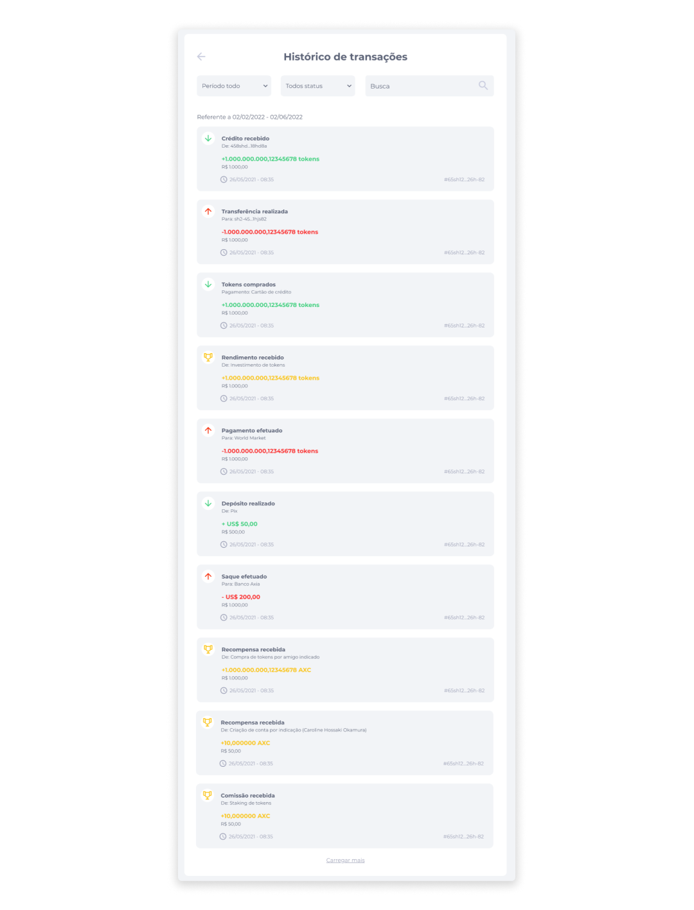

# Histórico de Transações
No histórico de transações, será exibido ao usuário todas as transações realizadas, como [transferências](../wallet/transfer.md), [recebimentos](../wallet/receive.md), [pagamentos](../profile/payments.md), [compras de tokens](../wallet/buytokens.md) e [envio de NFTs](../wallet/nfts.md).

Para localizar transações específicas, o usuário poderá aplicar filtros por Período (30 dias, 60 dias, 90 dias e Período todo) e por Status (Todos, Recebidos e Enviados), ou utilizar diretamente o campo de busca.

O histórico irá exibir os seguintes dados de acordo com cada tipo de transação:

#### Transações de Recebimento
- ID da chave do usuário que realizou a transferência.
- ID da transação.
- Data e hora em que a transação foi confirmada.
- Total de ativos transferidos.
- Valor convertido em moeda fiduciária.

 

#### Transações de Envio
- ID da chave do receptor.
- ID da transação.
- Data e hora em que a transação foi confirmada.
- Total de ativos transferidos.
- Valor convertido em moeda fiduciária.
- Taxa de transação.