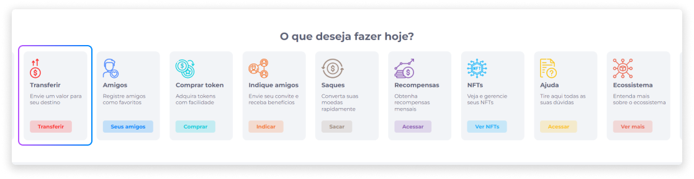
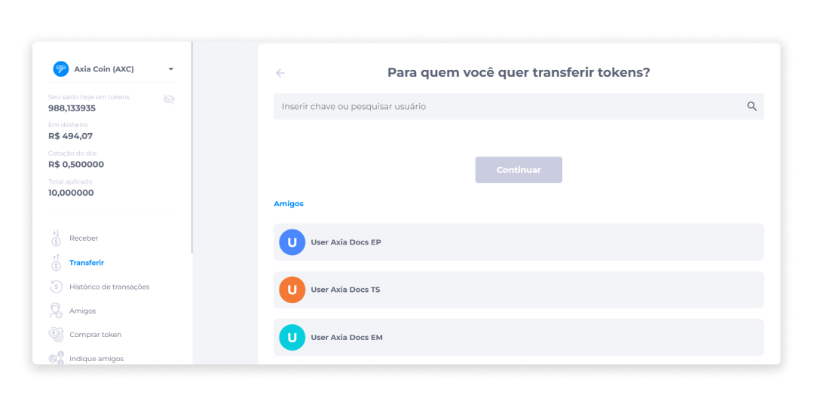
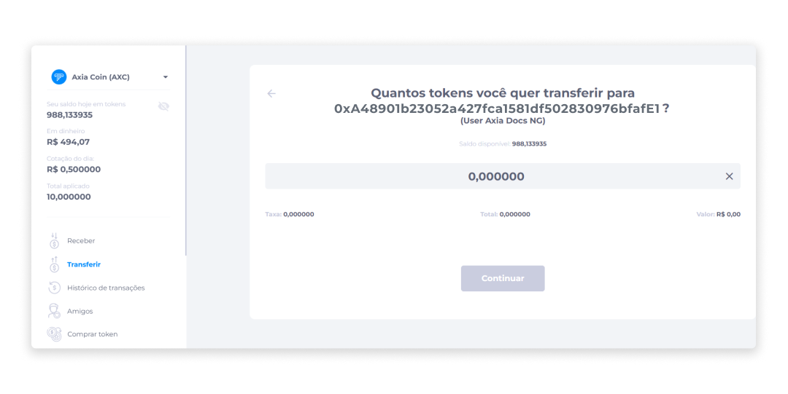
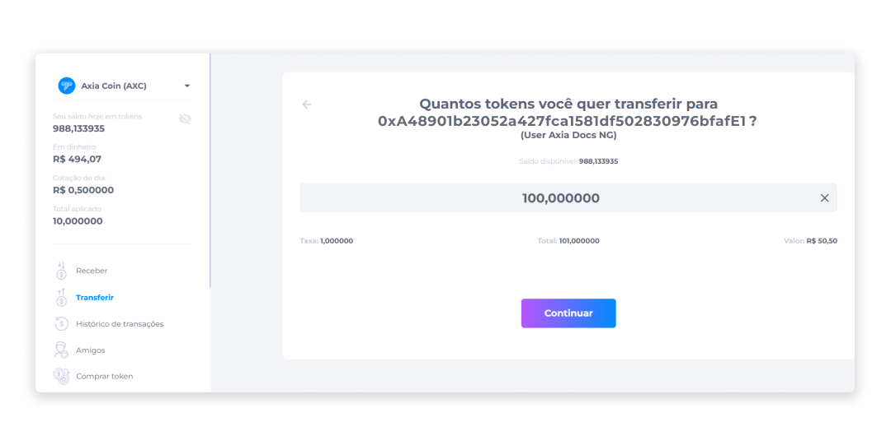
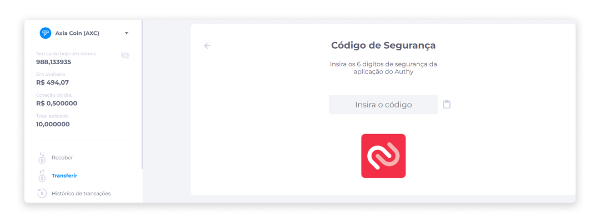
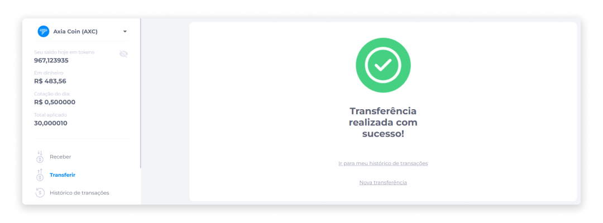

# Transferir
A transferência de tokens permite que um usuário envie ativos digitais para outros usuários.

::: info ℹ️ <infoblocktitle>Sobre Taxas de Transferência</infoblocktitle>
<infoblocktext>Taxas de transferência podem ser de valor absoluto ou percentual, e o valor sempre será exibido para que as transações sejam o mais transparente possível.  
As taxas de transferência podem variar, dependendo se a transferência será realizada para uma carteira interna (outra carteira Midas), ou para uma carteira externa (de outras plataformas).  
Caso haja um limite mínimo para realizar uma transferência, atente-se ao valor absoluto.</infoblocktext>
:::

Para realizar transferência de tokens:

1. Na página inicial ou no menu Perfil, clique na opção **Transferir**.

2. Insira a chave ou pesquise pelo nome do usuário que irá receber a transferência.
3. Clique em **Continuar**.

4. Informe a quantidade de tokens que será transferida.

5. Clique em **Continuar**.

6. Insira o código de autenticação fornecido pelo aplicativo **Authy**.

7. Verifique a mensagem de confirmação da transferência.

Após a confirmação, usuário pode verificar o registro da transação no Histórico de Transações ou realizar uma nova transferência.

::: warning ⚠️ <warningblocktitle>Atenção</warningblocktitle>
<warningblocktext>Para garantir a autenticidade e maior segurança na transferência, é necessária a prévia configuração da Autenticação de Dois Fatores.</warningblocktext>
:::