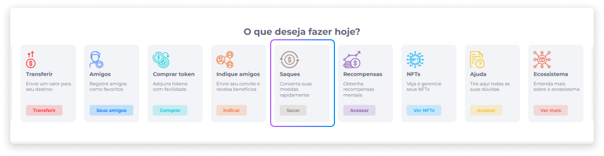

# Saques
A operação de saque pode ser realizada somente se o usuário possuir, em moeda fiduciária, o valor necessário para realizar a transação. O valor mínimo para o saque pode não existir, ou variar de acordo com o que a empresa contratante desejar.

## Solicitar um Saque
Para solicitar um saque:

1. Nas funções de acesso rápido da página inicial, clique em **Sacar**.

2. Insira o valor que deseja sacar.

3. Selecione em qual moeda deseja realizar o saque.

### Fiduciário (Outras instituições)
Se optar por realizar um saque em moeda fiduciária:

1. Selecione o banco.
2. Insira o número da agência.
3. Selecione o tipo de conta.
4. Insira o número da conta.
5. Selecione a entidade (Pessoa Física ou Pessoa Jurídica).
6. Insira seu nome.
7. Forneça seu CPF ou CNPJ.

8. Clique em **Solicitar saque**.

### Bitcoin
Se optar por realizar um saque em Bitcoin:

1. Insira o número da carteira.
2. Insira seu nome.

3. Clique em **Solicitar saque**.

### Ethereum
Se optar por realizar um saque em Ethereum:

1. Insira o número da carteira.
2. Insira seu nome.

3. Clique em **Solicitar saque**.

## Meus Saques
Na área de Saques, também é possível visualizar o histórico de saques realizados em moedas e períodos específicos.

